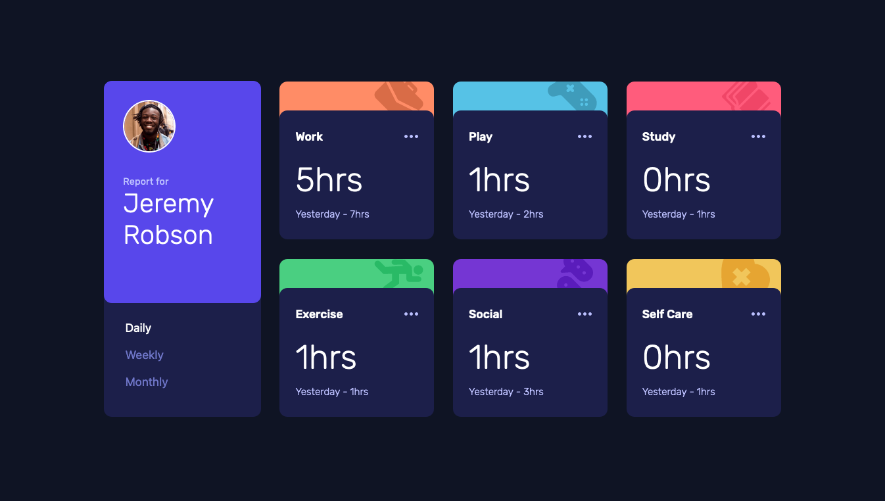

# Frontend Mentor - Time tracking dashboard solution

This is my solution to the [Time tracking dashboard challenge on Frontend Mentor](https://www.frontendmentor.io/challenges/time-tracking-dashboard-UIQ7167Jw). Frontend Mentor challenges help you improve your coding skills by building realistic projects.

## Table of contents

- [Overview](#overview)
  - [The challenge](#the-challenge)
  - [Screenshot](#screenshot)
  - [Links](#links)
- [Author](#author)

## Overview

### The challenge

Users should be able to:

- View the optimal layout for the site depending on their device's screen size
- See hover states for all interactive elements on the page
- Switch between viewing Daily, Weekly, and Monthly stats

### Screenshot

### Links

- Solution URL: [https://github.com/lexborron/time-tracking-dashboard](https://github.com/lexborron/time-tracking-dashboard)
- Live Site URL: [https://lexborron.github.io/time-tracking-dashboard/](https://lexborron.github.io/time-tracking-dashboard/)

## Author

- Frontend Mentor - [@lexborron](https://www.frontendmentor.io/profile/lexborron)
